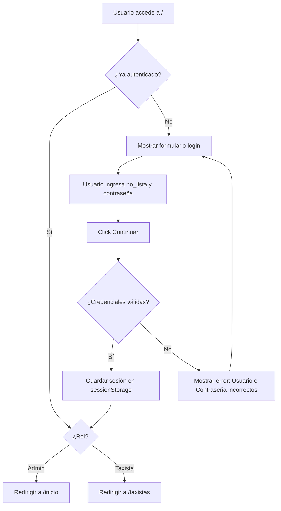
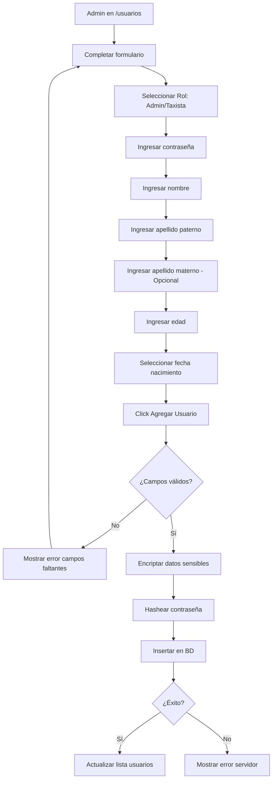
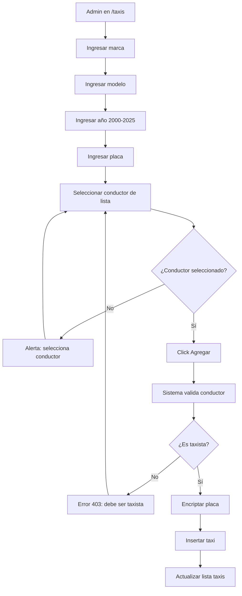
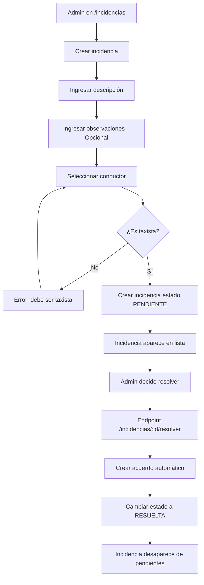
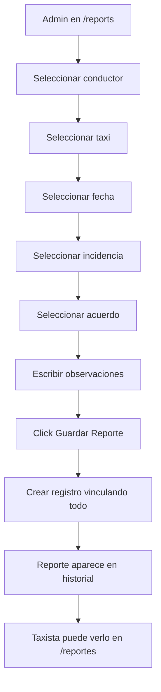
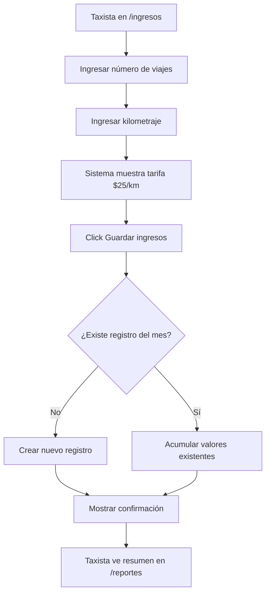
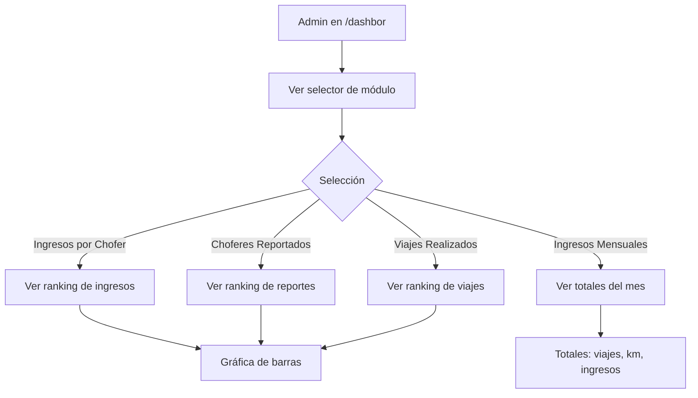

 # 📋 Documento Funcional - Sistema de Gestión de Taxis

> **Versión:** 1.0.0  
> **Última Actualización:** 2026-02-07  
> **Audiencia:** Project Managers y QA

---

## 📋 Índice

1. [Descripción General del Negocio](#descripción-general-del-negocio)
2. [Actores del Sistema](#actores-del-sistema)
3. [Reglas de Negocio](#reglas-de-negocio)
4. [Flujos de Usuario](#flujos-de-usuario)
5. [Criterios de Aceptación](#criterios-de-aceptación)
6. [Mensajes de Error y Respuestas al Usuario](#mensajes-de-error-y-respuestas-al-usuario)
7. [Pruebas Funcionales](#pruebas-funcionales)
8. [Matriz de Trazabilidad](#matriz-de-trazabilidad)

---

## 🏢 Descripción General del Negocio

El **Sistema de Gestión de Taxis** es una plataforma web diseñada para administrar las operaciones de una compañía de taxis, permitiendo:

1. **Gestión de Personal:** Registro y seguimiento de conductores (taxistas) y administradores
2. **Control de Flota:** Administración de vehículos, asignaciones y estados
3. **Seguimiento de Incidencias:** Registro de problemas reportados por conductores
4. **Resolución mediante Acuerdos:** Documentación de soluciones a incidencias
5. **Generación de Reportes:** Vinculación de conductor, vehículo, incidencia y acuerdo
6. **Control de Ingresos:** Registro de viajes, kilometraje y cálculo automático de ganancias
7. **Dashboard Analítico:** Visualización de métricas operativas

### Objetivos del Sistema

| Objetivo | Beneficiario |
|----------|--------------|
| Digitalizar gestión de flota | Administración |
| Centralizar información de incidencias | Supervisores |
| Automatizar cálculo de ingresos | Contabilidad |
| Proveer transparencia a conductores | Taxistas |
| Generar métricas de desempeño | Gerencia |

---

## 👥 Actores del Sistema

### Administrador

**Descripción:** Usuario con acceso total al sistema para gestionar todos los módulos.

**Permisos:**
- ✅ Crear, editar, eliminar usuarios
- ✅ Crear, editar, eliminar taxis
- ✅ Crear, editar, eliminar incidencias
- ✅ Crear, editar, eliminar acuerdos
- ✅ Crear, editar, eliminar reportes
- ✅ Ver dashboard completo
- ✅ Gestionar activos (usuarios + flota)
- ✅ Ver reportes históricos

**Rutas Accesibles:**
- `/inicio` - Panel principal
- `/usuarios` - Gestión de usuarios
- `/taxis` - Gestión de flota
- `/incidencias` - Gestión de incidencias
- `/acuerdo` - Gestión de acuerdos
- `/reports` - Gestión de reportes
- `/dashbor` - Dashboard analítico
- `/gestion` - Centro de control de activos
- `/reporte` - Reportes avanzados

---

### Taxista

**Descripción:** Conductor de la flota con acceso limitado a sus propios datos.

**Permisos:**
- ✅ Ver sus propios reportes
- ✅ Ver sus propios acuerdos
- ✅ Registrar sus ingresos (viajes/km)
- ❌ No puede modificar usuarios
- ❌ No puede modificar taxis
- ❌ No puede ver datos de otros taxistas

**Rutas Accesibles:**
- `/taxistas` - Panel principal taxista
- `/reportes` - Mis reportes
- `/resolution` - Mis acuerdos
- `/ingresos` - Registrar ingresos

---

## 📜 Reglas de Negocio

### RN-001: Autenticación y Roles

| ID | Regla |
|----|-------|
| RN-001.1 | Todo usuario debe autenticarse con su número de lista (`no_lista`) y contraseña |
| RN-001.2 | El sistema soporta exactamente dos roles: "Admin" y "Taxista" |
| RN-001.3 | Un usuario con rol "Admin" es redirigido a `/inicio` tras login |
| RN-001.4 | Un usuario con rol "Taxista" es redirigido a `/taxistas` tras login |
| RN-001.5 | Si un usuario autenticado accede a `/`, es redirigido automáticamente a su panel correspondiente |
| RN-001.6 | Las contraseñas se almacenan hasheadas con bcrypt (factor 10) |

### RN-002: Gestión de Usuarios

| ID | Regla |
|----|-------|
| RN-002.1 | Los campos obligatorios para crear usuario son: rol, contraseña, nombre, apellido paterno, edad, fecha de nacimiento |
| RN-002.2 | El apellido materno es opcional y puede ser nulo |
| RN-002.3 | Al crear un usuario sin especificar estatus, se asigna "Activo" por defecto |
| RN-002.4 | Los datos sensibles (nombre, apellidos, edad, fecha nacimiento) se encriptan con AES-256-CBC |
| RN-002.5 | Al editar usuario, si no se proporciona contraseña, la actual no se modifica |
| RN-002.6 | Los valores posibles de rol son: "Admin" o "Taxista" |
| RN-002.7 | Los valores posibles de estatus usuario son: "Activo" o "Inactivo" |

### RN-003: Gestión de Taxis

| ID | Regla |
|----|-------|
| RN-003.1 | Los campos obligatorios para crear taxi son: marca, modelo, año, placa |
| RN-003.2 | El año del taxi debe estar entre 2000 y 2025 (validación frontend) |
| RN-003.3 | **Solo usuarios con rol "Taxista" pueden ser asignados como conductores** |
| RN-003.4 | Si se intenta asignar un usuario no-taxista a un taxi, el sistema rechaza la operación con error 403 |
| RN-003.5 | Un taxi puede existir sin conductor asignado (`no_lista = null`) |
| RN-003.6 | La placa del taxi se encripta antes de almacenarse |
| RN-003.7 | Al crear taxi sin especificar estatus, se asigna "Activo" por defecto |
| RN-003.8 | Los valores posibles de estatus taxi son: "Activo" o "Mantenimiento" |

### RN-004: Gestión de Incidencias

| ID | Regla |
|----|-------|
| RN-004.1 | Los campos obligatorios para crear incidencia son: descripción, conductor (no_lista) |
| RN-004.2 | El campo observaciones es opcional |
| RN-004.3 | **Solo usuarios con rol "Taxista" pueden ser asignados a una incidencia** |
| RN-004.4 | Si se intenta asignar un usuario no-taxista, error 403 |
| RN-004.5 | Al crear incidencia, el estado por defecto es "PENDIENTE" |
| RN-004.6 | Los valores posibles de estado son: "PENDIENTE" o "RESUELTA" |
| RN-004.7 | Al resolver una incidencia, se crea automáticamente un acuerdo y el estado cambia a "RESUELTA" |
| RN-004.8 | No se puede eliminar una incidencia si está referenciada en reportes o acuerdos |

### RN-005: Gestión de Acuerdos

| ID | Regla |
|----|-------|
| RN-005.1 | Todo acuerdo debe estar vinculado a una incidencia |
| RN-005.2 | Los campos obligatorios son: descripción, id_incidencia |
| RN-005.3 | No se puede eliminar un acuerdo si está referenciado en un reporte |
| RN-005.4 | Un acuerdo puede crearse manualmente o automáticamente al resolver incidencia |

### RN-006: Gestión de Reportes

| ID | Regla |
|----|-------|
| RN-006.1 | Un reporte vincula: conductor, taxi, incidencia, acuerdo, fecha y observaciones |
| RN-006.2 | Todos los campos son requeridos al crear un reporte |
| RN-006.3 | Un taxista solo puede ver los reportes asociados a su no_lista |
| RN-006.4 | Los administradores pueden ver todos los reportes |

### RN-007: Gestión de Ingresos

| ID | Regla |
|----|-------|
| RN-007.1 | Los campos obligatorios son: no_lista, kilometraje_recorrido, numero_viajes, fecha |
| RN-007.2 | **La tarifa por kilómetro es fija: $25 MXN** |
| RN-007.3 | El monto se calcula automáticamente: `monto = kilometraje_recorrido × 25` |
| RN-007.4 | **Si ya existe un registro del mismo taxista para el mismo mes/año, los valores se acumulan** |
| RN-007.5 | El sistema extrae automáticamente mes y año de la fecha proporcionada |
| RN-007.6 | Los ingresos se registran por día pero se acumulan mensualmente |
| RN-007.7 | Un taxista solo puede ver el resumen de sus propios ingresos |

### RN-008: Dashboard

| ID | Regla |
|----|-------|
| RN-008.1 | El dashboard muestra datos de los últimos 30 días |
| RN-008.2 | Los rankings muestran máximo 10 resultados (viajes) o 5 resultados (ingresos/reportados) |
| RN-008.3 | Solo administradores pueden acceder al dashboard |
| RN-008.4 | El resumen mensual muestra totales del mes calendario actual |

---

## 🔄 Flujos de Usuario

### FU-001: Inicio de Sesión



**Pasos Detallados:**

1. El usuario accede a la URL raíz del sistema
2. Si ya tiene sesión activa, es redirigido automáticamente
3. Si no tiene sesión, ve el formulario de login
4. Ingresa su número de lista (no_lista) en el campo username
5. Ingresa su contraseña (campo oculto, con opción de mostrar)
6. Hace clic en "Continuar"
7. El sistema valida las credenciales
8. Si son correctas, guarda la sesión y redirige según rol
9. Si son incorrectas, muestra mensaje de error

---

### FU-002: Crear Nuevo Usuario (Admin)



**Pasos Detallados:**

1. El administrador navega a "Gestión de Usuarios"
2. Completa el formulario "Crear Nuevo Usuario"
3. Selecciona el rol (Admin o Taxista)
4. Ingresa la contraseña inicial
5. Completa los datos personales
6. Hace clic en "Agregar Usuario"
7. El sistema valida campos obligatorios
8. Si todo es correcto, encripta y guarda
9. La lista de usuarios se actualiza automáticamente

---

### FU-003: Registrar Taxi con Conductor



**Pasos Detallados:**

1. El administrador navega a "Administrar Taxis"
2. Completa los datos del vehículo
3. Selecciona un conductor de la lista desplegable (solo muestra taxistas)
4. Hace clic en "Agregar"
5. El sistema valida que el conductor tenga rol "Taxista"
6. Si es válido, registra el taxi con placa encriptada
7. La lista de taxis se actualiza

---

### FU-004: Reportar y Resolver Incidencia



**Pasos Detallados:**

1. Administrador crea nueva incidencia con descripción y conductor
2. La incidencia se guarda con estado "PENDIENTE"
3. Aparece en la lista de incidencias
4. Para resolverla, el admin puede usar filtro por estado
5. Al resolver, el sistema crea un acuerdo y cambia estado
6. El flujo completo queda documentado

---

### FU-005: Generar Reporte Completo



**Pasos Detallados:**

1. El administrador accede a "Gestión de Reportes"
2. Selecciona el conductor involucrado
3. Selecciona el taxi (muestra número económico y placa)
4. Selecciona la fecha del reporte
5. Vincula una incidencia existente
6. Vincula un acuerdo existente
7. Agrega observaciones descriptivas
8. Guarda el reporte
9. El reporte queda visible para el taxista

---

### FU-006: Taxista Registra Ingresos



**Pasos Detallados:**

1. El taxista accede a "Registrar Ingresos"
2. Ingresa el número de viajes realizados
3. Ingresa el kilometraje total recorrido
4. Ve la tarifa fija aplicada ($25 MXN/km)
5. Hace clic en "Guardar ingresos"
6. El sistema calcula automáticamente el monto
7. Si ya había registros del mes, acumula los valores
8. Muestra mensaje de confirmación
9. El taxista puede ver su resumen mensual en "Mis Reportes"

---

### FU-007: Ver Dashboard Analítico (Admin)



**Pasos Detallados:**

1. El administrador accede al Dashboard
2. Selecciona el módulo a analizar
3. La tabla y gráfica se actualizan
4. Puede cambiar entre diferentes visualizaciones
5. Los datos son de los últimos 30 días (excepto resumen mensual)

---

## ✅ Criterios de Aceptación

### CA-001: Inicio de Sesión

| ID | Criterio | Resultado Esperado |
|----|----------|-------------------|
| CA-001.1 | Login con credenciales correctas de Admin | Redirige a `/inicio`, sesión guardada |
| CA-001.2 | Login con credenciales correctas de Taxista | Redirige a `/taxistas`, sesión guardada |
| CA-001.3 | Login con usuario inexistente | Mensaje "Usuario o Contraseña incorrectos" |
| CA-001.4 | Login con contraseña incorrecta | Mensaje "Usuario o Contraseña incorrectos" |
| CA-001.5 | Login sin completar campos | Validación HTML5 impide envío |
| CA-001.6 | Usuario autenticado accede a `/` | Redirige automáticamente a su panel |

### CA-002: Gestión de Usuarios

| ID | Criterio | Resultado Esperado |
|----|----------|-------------------|
| CA-002.1 | Crear usuario con todos los campos obligatorios | Usuario creado, aparece en lista |
| CA-002.2 | Crear usuario sin campo obligatorio | Error 400, mensaje específico |
| CA-002.3 | Editar usuario sin cambiar contraseña | Datos actualizados, contraseña original |
| CA-002.4 | Editar usuario cambiando contraseña | Nueva contraseña hasheada y funcional |
| CA-002.5 | Eliminar usuario existente | Usuario removido de lista |
| CA-002.6 | Datos encriptados en BD | Campos sensibles ilegibles directamente |

### CA-003: Gestión de Taxis

| ID | Criterio | Resultado Esperado |
|----|----------|-------------------|
| CA-003.1 | Crear taxi con conductor taxista | Taxi creado, conductor visible |
| CA-003.2 | Crear taxi asignando usuario admin | Error 403 "debe ser taxista" |
| CA-003.3 | Crear taxi sin conductor | Taxi creado con "Sin asignar" |
| CA-003.4 | Editar taxi reasignando conductor | Nuevo conductor asignado correctamente |
| CA-003.5 | Eliminar taxi | Taxi removido de lista |
| CA-003.6 | Placa encriptada en BD | Campo placa ilegible directamente |

### CA-004: Gestión de Incidencias

| ID | Criterio | Resultado Esperado |
|----|----------|-------------------|
| CA-004.1 | Crear incidencia con taxista | Incidencia creada estado PENDIENTE |
| CA-004.2 | Crear incidencia con admin | Error 403 "no es taxista" |
| CA-004.3 | Resolver incidencia | Estado cambia a RESUELTA, acuerdo creado |
| CA-004.4 | Eliminar incidencia sin referencias | Incidencia eliminada |
| CA-004.5 | Eliminar incidencia con reportes | Error "incidencia está en uso" |
| CA-004.6 | Filtrar por estado | Solo muestra incidencias del estado |

### CA-005: Gestión de Acuerdos

| ID | Criterio | Resultado Esperado |
|----|----------|-------------------|
| CA-005.1 | Crear acuerdo vinculado a incidencia | Acuerdo creado con referencia |
| CA-005.2 | Eliminar acuerdo sin reportes | Acuerdo eliminado |
| CA-005.3 | Eliminar acuerdo en uso | Error "acuerdo está en uso" |

### CA-006: Gestión de Reportes

| ID | Criterio | Resultado Esperado |
|----|----------|-------------------|
| CA-006.1 | Crear reporte completo | Reporte visible en historial |
| CA-006.2 | Taxista ve sus reportes | Solo ve reportes con su no_lista |
| CA-006.3 | Admin ve todos los reportes | Historial completo visible |
| CA-006.4 | Eliminar reporte | Reporte removido |

### CA-007: Registro de Ingresos

| ID | Criterio | Resultado Esperado |
|----|----------|-------------------|
| CA-007.1 | Registrar ingresos primer día del mes | Nuevo registro creado |
| CA-007.2 | Registrar ingresos mismo mes | Valores acumulados |
| CA-007.3 | Cálculo de monto | monto = km × 25 |
| CA-007.4 | Ver resumen mensual | Totales correctos del mes |

### CA-008: Dashboard

| ID | Criterio | Resultado Esperado |
|----|----------|-------------------|
| CA-008.1 | Ver ranking ingresos | Lista ordenada descendente |
| CA-008.2 | Ver choferes reportados | Cuenta correcta de reportes |
| CA-008.3 | Ver viajes top | Lista de hasta 10 conductores |
| CA-008.4 | Ver ingresos mensuales | Totales del mes actual |

---

## ❌ Mensajes de Error y Respuestas al Usuario

### Errores de Autenticación

| Código | Mensaje Sistema | Contexto |
|--------|-----------------|----------|
| 401 | "Usuario o Contraseña incorrectos." | Login fallido |
| 500 | "Error interno del servidor." | Fallo de BD/bcrypt |
| N/A | "No se pudo conectar con el servidor. Intente de nuevo." | Error de red |

### Errores de Validación

| Código | Mensaje Sistema | Contexto |
|--------|-----------------|----------|
| 400 | "Faltan campos obligatorios. Asegúrate de enviar: rol, contrasena, nombre, apellido_p, edad, fecha_de_nacimiento." | Crear usuario incompleto |
| 400 | "La descripción y el conductor son obligatorios." | Crear incidencia incompleta |
| 400 | "Mes y año inválidos" | Consulta ingresos sin parámetros |
| 400 | "Faltan datos obligatorios" | Registrar ingresos incompleto |

### Errores de Reglas de Negocio

| Código | Mensaje Sistema | Contexto |
|--------|-----------------|----------|
| 403 | "El conductor asignado debe ser un taxista." | Asignar no-taxista a taxi |
| 403 | "El conductor debe ser un taxista." | Reasignar no-taxista a taxi |
| 403 | "Operación no permitida: El usuario seleccionado no es un taxista." | Asignar no-taxista a incidencia |
| 400 | "No se puede eliminar: la incidencia está en uso." | FK violation incidencia |
| 400 | "No se puede eliminar: el acuerdo está en uso en un reporte." | FK violation acuerdo |

### Errores de Servidor

| Código | Mensaje Sistema | Contexto |
|--------|-----------------|----------|
| 404 | "Usuario no encontrado" | GET usuario por ID inexistente |
| 500 | "Error interno del servidor." | Cualquier excepción no manejada |
| 500 | {"error": "mensaje técnico"} | Error de BD detallado |

### Mensajes de Éxito

| Mensaje | Contexto |
|---------|----------|
| "Inicio de sesión exitoso" | Login correcto |
| "Usuario creado exitosamente" | POST usuario |
| "Usuario actualizado" | PUT usuario |
| "Usuario eliminado exitosamente" | DELETE usuario |
| "Taxi creado exitosamente" | POST taxi |
| "Taxi actualizado exitosamente" | PUT taxi |
| "Taxi eliminado exitosamente" | DELETE taxi |
| "Incidencia creada" | POST incidencia |
| "Incidencia actualizada" | PUT incidencia |
| "Incidencia eliminada exitosamente" | DELETE incidencia |
| "Incidencia resuelta" | POST resolver incidencia |
| "Acuerdo creado" | POST acuerdo |
| "Acuerdo actualizado" | PUT acuerdo |
| "Acuerdo eliminado exitosamente" | DELETE acuerdo |
| "Reporte creado" | POST reporte |
| "Reporte actualizado" | PUT reporte |
| "Reporte eliminado exitosamente" | DELETE reporte |
| "Ingresos registrados correctamente" | POST ingresos (frontend) |

### Alertas Frontend

| Tipo | Mensaje | Trigger |
|------|---------|---------|
| Alert | "Por favor, selecciona un conductor." | Submit sin conductor |
| Alert | "¿Seguro que quieres eliminar este acuerdo?" | Confirmar eliminación |
| Alert | "¿Seguro que deseas eliminar este usuario/taxi?" | Confirmar en GestionActivos |
| Alert | "Error al guardar ingresos" | POST ingresos falla |

---

## 🧪 Pruebas Funcionales

### Suite: Autenticación (PF-AUTH)

| ID | Caso de Prueba | Precondiciones | Pasos | Resultado Esperado |
|----|----------------|----------------|-------|-------------------|
| PF-AUTH-001 | Login exitoso Admin | Usuario admin existe en BD | 1. Ir a / 2. Ingresar no_lista=1, pass correcta 3. Click Continuar | Redirige a /inicio |
| PF-AUTH-002 | Login exitoso Taxista | Usuario taxista existe | 1. Ir a / 2. Ingresar credenciales taxista 3. Click Continuar | Redirige a /taxistas |
| PF-AUTH-003 | Login usuario inexistente | - | 1. Ir a / 2. Ingresar no_lista=99999 3. Click Continuar | Error "Usuario o Contraseña incorrectos" |
| PF-AUTH-004 | Login contraseña incorrecta | Usuario existe | 1. Ir a / 2. Ingresar pass incorrecta 3. Click Continuar | Error "Usuario o Contraseña incorrectos" |
| PF-AUTH-005 | Logout | Usuario autenticado | 1. Click botón logout | Sesión eliminada, redirige a / |
| PF-AUTH-006 | Acceso ruta protegida sin auth | No autenticado | 1. Navegar directamente a /usuarios | Redirige a / |
| PF-AUTH-007 | Taxista accede ruta admin | Taxista autenticado | 1. Navegar a /usuarios | Redirige a / |

### Suite: Usuarios (PF-USR)

| ID | Caso de Prueba | Precondiciones | Pasos | Resultado Esperado |
|----|----------------|----------------|-------|-------------------|
| PF-USR-001 | Crear usuario completo | Admin autenticado | 1. Ir a /usuarios 2. Completar formulario 3. Click Agregar | Usuario en lista |
| PF-USR-002 | Crear sin nombre | Admin autenticado | 1. Dejar nombre vacío 2. Click Agregar | Validación HTML impide envío |
| PF-USR-003 | Editar usuario | Admin, usuario existe | 1. Click Editar 2. Modificar nombre 3. Guardar | Nombre actualizado |
| PF-USR-004 | Editar sin cambiar pass | Admin, modal abierto | 1. Dejar contraseña vacía 2. Guardar | Pass original funciona |
| PF-USR-005 | Eliminar usuario | Admin, usuario existe | 1. Click Eliminar | Usuario removido |
| PF-USR-006 | Ver lista taxistas | Admin autenticado | 1. Llamar GET /usuarios/taxistas | Solo rol=Taxista |

### Suite: Taxis (PF-TAX)

| ID | Caso de Prueba | Precondiciones | Pasos | Resultado Esperado |
|----|----------------|----------------|-------|-------------------|
| PF-TAX-001 | Crear taxi con conductor | Taxista existe | 1. Completar form 2. Seleccionar taxista 3. Agregar | Taxi creado |
| PF-TAX-002 | Crear taxi sin conductor | Admin | 1. No seleccionar conductor 2. Agregar | Alert "selecciona conductor" |
| PF-TAX-003 | Crear asignando admin | Usuario admin existe | 1. Seleccionar admin 2. Agregar | Error 403 en consola |
| PF-TAX-004 | Ver conductor asignado | Taxi con conductor | 1. Ver lista | Nombre visible |
| PF-TAX-005 | Reasignar conductor | Taxi existe | 1. Editar 2. Cambiar conductor 3. Guardar | Nuevo conductor |

### Suite: Incidencias (PF-INC)

| ID | Caso de Prueba | Precondiciones | Pasos | Resultado Esperado |
|----|----------------|----------------|-------|-------------------|
| PF-INC-001 | Crear incidencia | Taxista existe | 1. Descripción 2. Seleccionar taxi 3. Agregar | Estado PENDIENTE |
| PF-INC-002 | Resolver incidencia | Incidencia PENDIENTE | 1. Llamar POST /incidencias/:id/resolver | Estado RESUELTA, acuerdo creado |
| PF-INC-003 | Filtrar por estado | Incidencias existen | 1. GET /incidencias?estado=PENDIENTE | Solo PENDIENTES |
| PF-INC-004 | Eliminar en uso | Incidencia con reporte | 1. Click Eliminar | Error "en uso" |

### Suite: Ingresos (PF-ING)

| ID | Caso de Prueba | Precondiciones | Pasos | Resultado Esperado |
|----|----------------|----------------|-------|-------------------|
| PF-ING-001 | Registrar primer ingreso | Taxista sin registros del mes | 1. Ingresar viajes=10, km=50 2. Guardar | Registro creado, monto=1250 |
| PF-ING-002 | Acumular ingresos | Registro mes existe | 1. Ingresar viajes=5, km=25 2. Guardar | Valores sumados |
| PF-ING-003 | Ver resumen mensual | Registros existen | 1. GET /ingresos/taxista/:id?mes=2&anio=2026 | Totales correctos |
| PF-ING-004 | Validar cálculo | - | 1. km=100, tarifa=25 | monto=2500 |

### Suite: Dashboard (PF-DASH)

| ID | Caso de Prueba | Precondiciones | Pasos | Resultado Esperado |
|----|----------------|----------------|-------|-------------------|
| PF-DASH-001 | Ver ranking ingresos | Datos de 30 días | 1. Seleccionar "Ingresos por Chofer" | Lista ordenada |
| PF-DASH-002 | Ver gráfica | Módulo seleccionado | 1. Ver sección gráfica | Bar chart visible |
| PF-DASH-003 | Cambiar módulo | Dashboard cargado | 1. Cambiar selector | Datos actualizados |

### Suite: Seguridad (PF-SEC)

| ID | Caso de Prueba | Precondiciones | Pasos | Resultado Esperado |
|----|----------------|----------------|-------|-------------------|
| PF-SEC-001 | Datos encriptados en BD | Usuario creado | 1. SELECT nombre FROM usuario | Valor tipo "abc:123..." |
| PF-SEC-002 | Datos desencriptados en API | Usuario existe | 1. GET /usuarios | Nombre legible |
| PF-SEC-003 | Contraseña hasheada | Usuario creado | 1. SELECT contrasena FROM usuario | Hash bcrypt "$2b$10$..." |
| PF-SEC-004 | Placa encriptada | Taxi creado | 1. SELECT placa FROM taxi | Valor tipo "abc:123..." |

---

## 📊 Matriz de Trazabilidad

### Reglas de Negocio → Casos de Prueba

| Regla | Casos de Prueba Relacionados |
|-------|------------------------------|
| RN-001.1 | PF-AUTH-001, PF-AUTH-002, PF-AUTH-003, PF-AUTH-004 |
| RN-001.2 | PF-AUTH-001, PF-AUTH-002 |
| RN-001.3 | PF-AUTH-001 |
| RN-001.4 | PF-AUTH-002 |
| RN-001.5 | PF-AUTH-001, PF-AUTH-002 |
| RN-001.6 | PF-SEC-003 |
| RN-002.1 | PF-USR-001, PF-USR-002 |
| RN-002.4 | PF-SEC-001, PF-SEC-002 |
| RN-002.5 | PF-USR-003, PF-USR-004 |
| RN-003.3 | PF-TAX-001, PF-TAX-003 |
| RN-003.4 | PF-TAX-003 |
| RN-003.6 | PF-SEC-004 |
| RN-004.3 | PF-INC-001 |
| RN-004.7 | PF-INC-002 |
| RN-004.8 | PF-INC-004 |
| RN-007.2 | PF-ING-004 |
| RN-007.3 | PF-ING-001, PF-ING-004 |
| RN-007.4 | PF-ING-002 |

### Flujos de Usuario → Casos de Prueba

| Flujo | Casos de Prueba Relacionados |
|-------|------------------------------|
| FU-001 | PF-AUTH-001 a PF-AUTH-007 |
| FU-002 | PF-USR-001 a PF-USR-005 |
| FU-003 | PF-TAX-001 a PF-TAX-005 |
| FU-004 | PF-INC-001 a PF-INC-004 |
| FU-006 | PF-ING-001 a PF-ING-004 |
| FU-007 | PF-DASH-001 a PF-DASH-003 |

### Criterios de Aceptación → Casos de Prueba

| Criterio | Casos de Prueba |
|----------|-----------------|
| CA-001.x | PF-AUTH-001 a PF-AUTH-006 |
| CA-002.x | PF-USR-001 a PF-USR-006, PF-SEC-001 a PF-SEC-003 |
| CA-003.x | PF-TAX-001 a PF-TAX-005, PF-SEC-004 |
| CA-004.x | PF-INC-001 a PF-INC-004 |
| CA-007.x | PF-ING-001 a PF-ING-004 |
| CA-008.x | PF-DASH-001 a PF-DASH-003 |

---

## 📝 Notas Adicionales para QA

### Datos de Prueba Recomendados

```
Usuario Admin:
- no_lista: 1
- rol: Admin
- contraseña: Admin123

Usuario Taxista:
- no_lista: 2
- rol: Taxista
- contraseña: Taxista123

Taxi de prueba:
- marca: Toyota
- modelo: Corolla
- año: 2023
- placa: ABC-123
```

### Ambiente de Pruebas

- Backend: `http://localhost:3000`
- Frontend: `http://localhost:5173`
- Base de datos: PostgreSQL local

### Herramientas Sugeridas

| Herramienta | Propósito |
|-------------|-----------|
| Postman | Pruebas API |
| Browser DevTools | Inspección red/console |
| pgAdmin | Verificación BD |
| React DevTools | Estado componentes |

---

*Documentación funcional generada el 2026-02-07*
