# 🏗️ Documento de Arquitectura Técnica - Sistema de Gestión de Taxis

> **Versión:** 1.0.0  
> **Última Actualización:** 2026-02-07  
> **Audiencia:** Desarrolladores y Tech Leads

---

## 📋 Índice

1. [Visión General de Arquitectura](#visión-general-de-arquitectura)
2. [Patrones de Diseño Utilizados](#patrones-de-diseño-utilizados)
3. [Diagramas de Arquitectura](#diagramas-de-arquitectura)
4. [Detalle Completo de APIs](#detalle-completo-de-apis)
5. [Base de Datos](#base-de-datos)
6. [Seguridad y Criptografía](#seguridad-y-criptografía)
7. [Frontend Architecture](#frontend-architecture)
8. [CI/CD y Despliegue](#cicd-y-despliegue)
9. [Notas de Mejora](#notas-de-mejora)

---

## 🔭 Visión General de Arquitectura

El sistema implementa una arquitectura **Cliente-Servidor** con separación clara entre frontend y backend:

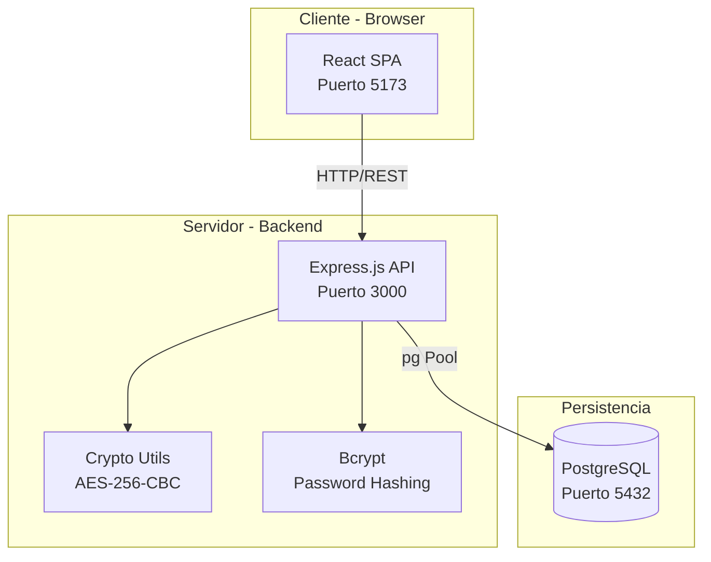

### Características Arquitectónicas

| Característica | Implementación |
|----------------|----------------|
| **Tipo** | Monolítica (Backend) + SPA (Frontend) |
| **Comunicación** | REST API sobre HTTP |
| **Estado Cliente** | sessionStorage + React Context |
| **Encriptación** | AES-256-CBC simétrico |
| **Autenticación** | Basada en roles (sin JWT) |

---

## 🎨 Patrones de Diseño Utilizados

### 1. Patrón MVC Simplificado (Backend)

El backend implementa una versión simplificada de MVC donde:
- **Model:** Queries SQL directas con `pg` pool
- **View:** Respuestas JSON
- **Controller:** Handlers de Express en `server.js`

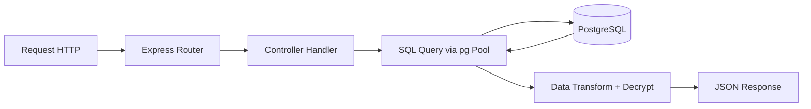

### 2. Patrón Repository Implícito

Cada endpoint encapsula su lógica de acceso a datos:

```javascript
// Ejemplo: server.js líneas 130-163
app.get("/usuarios", async (req, res) => {
  const sqlQuery = `SELECT ... FROM usuario`;
  const { rows: results } = await pool.query(sqlQuery);
  // Transform & decrypt
  res.json(usuariosDesencriptados);
});
```

### 3. Patrón Provider (Frontend)

El estado de autenticación se gestiona mediante React Context API:

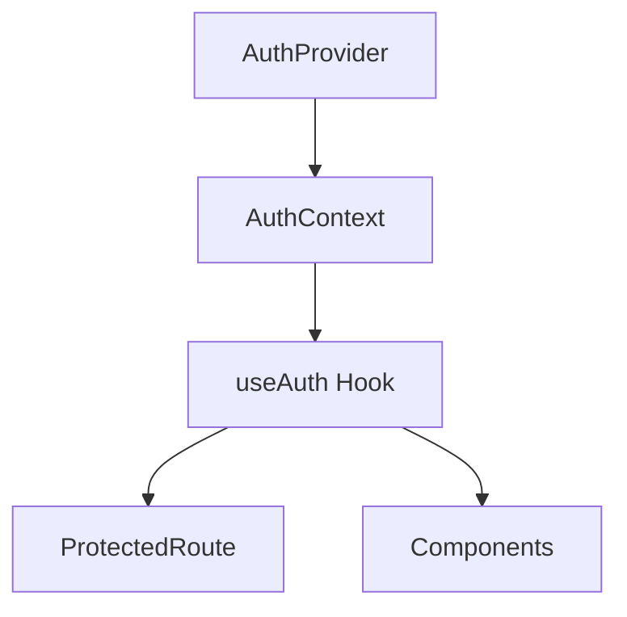

**Implementación en `AuthContext.jsx`:**

```javascript
export function AuthProvider({ children }) {
  const [user, setUser] = useState(() => {
    const savedUser = sessionStorage.getItem('user');
    return savedUser ? JSON.parse(savedUser) : null;
  });

  const login = (userData) => {
    sessionStorage.setItem('user', JSON.stringify(userData));
    setUser(userData);
  };

  const logout = () => {
    sessionStorage.removeItem('user');
    setUser(null);
  };

  const isAuthenticated = !!user;

  return (
    <AuthContext.Provider value={{ user, isAuthenticated, login, logout }}>
      {children}
    </AuthContext.Provider>
  );
}
```

### 4. Patrón HOC (Higher-Order Component) para Protección de Rutas

```javascript
// ProtectedRoute.jsx
function ProtectedRoute({ rolRequerido }) {
  const { isAuthenticated, user } = useAuth();

  if (!isAuthenticated) {
    return <Navigate to="/" />;
  }

  if (rolRequerido && user.rol?.toLowerCase() !== rolRequerido) {
    return <Navigate to="/" />;
  }

  return <Outlet />;
}
```

### 5. Patrón Decorator para Encriptación

Las funciones `encrypt()` y `decrypt()` actúan como decoradores de datos:

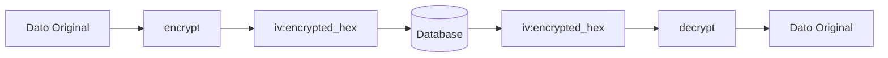

---

## 📊 Diagramas de Arquitectura

### Diagrama de Flujo: Autenticación

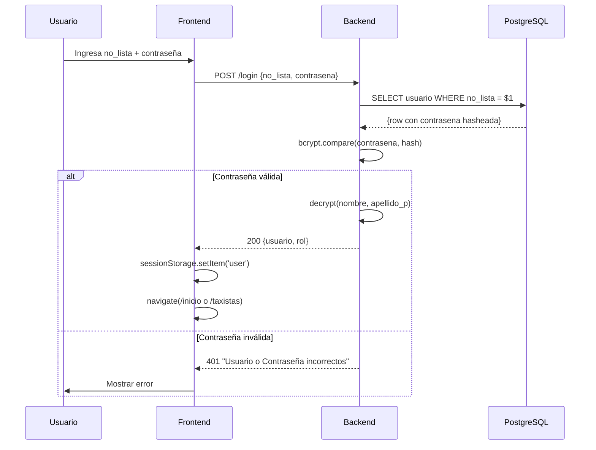

### Diagrama de Flujo: Creación de Usuario

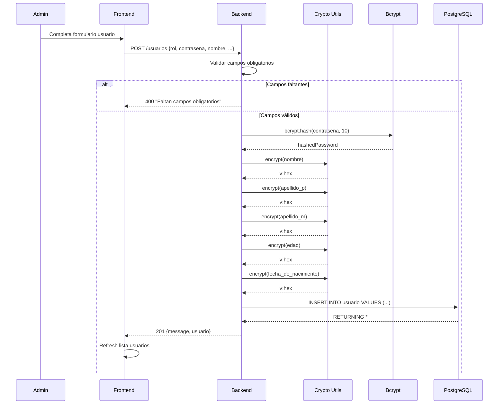

### Diagrama de Flujo: Creación de Taxi con Validación

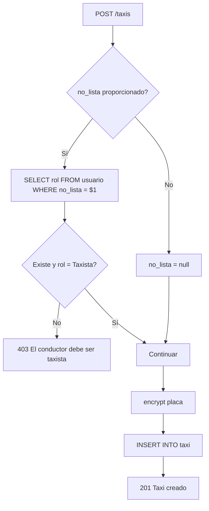

### Diagrama de Flujo: Resolución de Incidencia

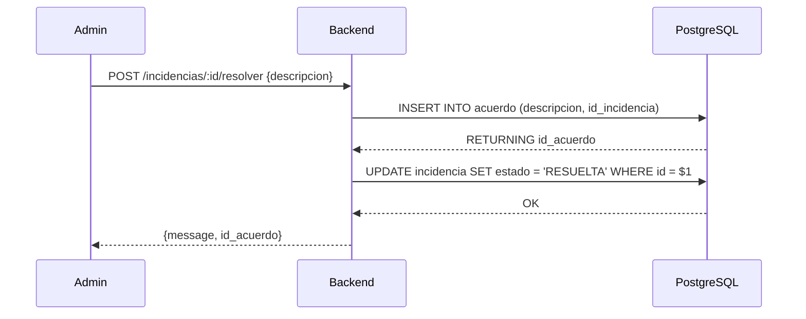

### Diagrama de Componentes Frontend

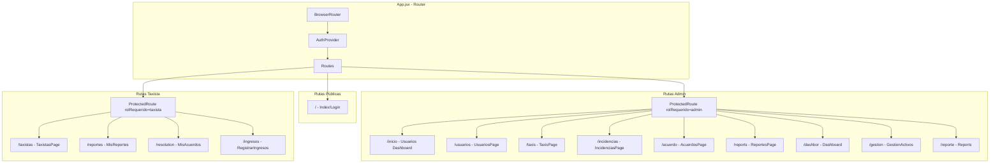

---

## 🔌 Detalle Completo de APIs

### POST `/login`

**Descripción:** Autenticación de usuarios con validación bcrypt.

**Headers Requeridos:**
```
Content-Type: application/json
```

**Request Body:**
```json
{
  "no_lista": 1,
  "contrasena": "password123"
}
```

**Response Exitosa (200):**
```json
{
  "message": "Inicio de sesión exitoso",
  "usuario": {
    "no_lista": 1,
    "rol": "Admin",
    "nombre": "Juan",
    "apellido_p": "Pérez"
  },
  "rol": "Admin"
}
```

**Response Error (401):**
```json
{
  "message": "Usuario o Contraseña incorrectos."
}
```

**Response Error (500):**
```json
{
  "message": "Error interno del servidor."
}
```

---

### POST `/usuarios`

**Descripción:** Crear nuevo usuario con encriptación de datos sensibles.

**Headers Requeridos:**
```
Content-Type: application/json
```

**Request Body:**
```json
{
  "rol": "Taxista",
  "contrasena": "password123",
  "nombre": "Carlos",
  "apellido_p": "García",
  "apellido_m": "López",
  "edad": 35,
  "fecha_de_nacimiento": "1991-05-15",
  "estatus": "Activo"
}
```

**Campos Obligatorios:** `rol`, `contrasena`, `nombre`, `apellido_p`, `edad`, `fecha_de_nacimiento`

**Campos Opcionales:** `apellido_m`, `estatus` (default: "Activo")

**Response Exitosa (201):**
```json
{
  "message": "Usuario creado exitosamente",
  "usuario": {
    "no_lista": 5,
    "rol": "Taxista",
    "contrasena": "$2b$10$...",
    "nombre": "a1b2c3d4e5f6:789abc...",
    "apellido_p": "f6e5d4c3b2a1:def012...",
    "apellido_m": null,
    "edad": "a9b8c7d6e5f4:345678...",
    "fecha_de_nacimiento": "c3d4e5f6a7b8:901234...",
    "estatus": "Activo"
  }
}
```

**Response Error (400):**
```json
{
  "message": "Faltan campos obligatorios. Asegúrate de enviar: rol, contrasena, nombre, apellido_p, edad, fecha_de_nacimiento."
}
```

---

### GET `/usuarios`

**Descripción:** Obtener todos los usuarios con datos desencriptados.

**Headers Requeridos:** Ninguno

**Response Exitosa (200):**
```json
[
  {
    "no_lista": 1,
    "rol": "Admin",
    "nombre": "Juan",
    "apellido_p": "Pérez",
    "apellido_m": "García",
    "edad": 30,
    "fecha_de_nacimiento": "1994-03-20",
    "estatus": "Activo"
  },
  {
    "no_lista": 2,
    "rol": "Taxista",
    "nombre": "Carlos",
    "apellido_p": "López",
    "apellido_m": null,
    "edad": 45,
    "fecha_de_nacimiento": "1981-08-10",
    "estatus": "Activo"
  }
]
```

---

### GET `/usuarios/:id`

**Descripción:** Obtener usuario específico por su no_lista.

**Parámetros URL:**
- `id` (integer): Número de lista del usuario

**Response Exitosa (200):**
```json
{
  "no_lista": 1,
  "rol": "Admin",
  "nombre": "Juan",
  "apellido_p": "Pérez",
  "apellido_m": "García",
  "edad": 30,
  "fecha_de_nacimiento": "1994-03-20"
}
```

**Response Error (404):**
```json
{
  "message": "Usuario no encontrado"
}
```

---

### GET `/usuarios/taxistas`

**Descripción:** Obtener solo usuarios con rol "Taxista".

**Response Exitosa (200):**
```json
[
  {
    "no_lista": 2,
    "rol": "Taxista",
    "nombre": "Carlos",
    "apellido_p": "López"
  },
  {
    "no_lista": 3,
    "rol": "Taxista",
    "nombre": "María",
    "apellido_p": "Hernández"
  }
]
```

---

### PUT `/usuarios/:id`

**Descripción:** Actualizar usuario existente. La contraseña solo se actualiza si se proporciona.

**Parámetros URL:**
- `id` (integer): Número de lista del usuario

**Request Body:**
```json
{
  "rol": "Admin",
  "nombre": "Juan Carlos",
  "apellido_p": "Pérez",
  "apellido_m": "García",
  "edad": 31,
  "fecha_de_nacimiento": "1994-03-20",
  "estatus": "Activo",
  "contrasena": "nuevaPassword123"
}
```

**Nota:** Si `contrasena` está vacío o no se envía, no se modifica.

**Response Exitosa (200):**
```json
{
  "message": "Usuario actualizado"
}
```

---

### DELETE `/usuarios/:id`

**Descripción:** Eliminar usuario por su no_lista.

**Parámetros URL:**
- `id` (integer): Número de lista del usuario

**Response Exitosa (200):**
```json
{
  "message": "Usuario eliminado exitosamente"
}
```

---

### POST `/taxis`

**Descripción:** Crear nuevo taxi con validación de conductor.

**Request Body:**
```json
{
  "marca": "Toyota",
  "modelo": "Corolla",
  "año": 2023,
  "placa": "ABC-123",
  "no_lista": 2,
  "estatus": "Activo"
}
```

**Campos Obligatorios:** `marca`, `modelo`, `año`, `placa`

**Campos Opcionales:** `no_lista`, `estatus` (default: "Activo")

**Validación:** Si se proporciona `no_lista`, el usuario debe existir y tener rol "Taxista".

**Response Exitosa (201):**
```json
{
  "message": "Taxi creado exitosamente",
  "id": 1
}
```

**Response Error (403):**
```json
{
  "message": "El conductor asignado debe ser un taxista."
}
```

---

### GET `/taxis`

**Descripción:** Obtener todos los taxis con información del conductor (JOIN).

**Response Exitosa (200):**
```json
[
  {
    "economico": 1,
    "marca": "Toyota",
    "modelo": "Corolla",
    "año": 2023,
    "placa": "ABC-123",
    "no_lista": 2,
    "estatus": "Activo",
    "nombre_conductor": "Carlos López"
  },
  {
    "economico": 2,
    "marca": "Nissan",
    "modelo": "Versa",
    "año": 2022,
    "placa": "XYZ-789",
    "no_lista": null,
    "estatus": "Mantenimiento",
    "nombre_conductor": "Sin asignar"
  }
]
```

---

### PUT `/taxis/:id`

**Descripción:** Actualizar taxi existente.

**Parámetros URL:**
- `id` (integer): Número económico del taxi

**Request Body:**
```json
{
  "marca": "Toyota",
  "modelo": "Camry",
  "año": 2024,
  "placa": "DEF-456",
  "no_lista": 3,
  "estatus": "Activo"
}
```

**Response Exitosa (200):**
```json
{
  "message": "Taxi actualizado exitosamente"
}
```

**Response Error (403):**
```json
{
  "message": "El conductor debe ser un taxista."
}
```

---

### DELETE `/taxis/:id`

**Descripción:** Eliminar taxi por su número económico.

**Parámetros URL:**
- `id` (integer): Número económico del taxi

**Response Exitosa (200):**
```json
{
  "message": "Taxi eliminado exitosamente"
}
```

---

### POST `/incidencias`

**Descripción:** Crear nueva incidencia asociada a un conductor.

**Request Body:**
```json
{
  "descripcion": "Falla en el sistema de frenos",
  "observaciones": "Requiere revisión urgente",
  "no_lista": 2
}
```

**Campos Obligatorios:** `descripcion`, `no_lista`

**Campos Opcionales:** `observaciones`

**Validación:** `no_lista` debe ser un usuario con rol "Taxista".

**Response Exitosa (201):**
```json
{
  "message": "Incidencia creada",
  "id": 1
}
```

**Response Error (400):**
```json
{
  "message": "La descripción y el conductor son obligatorios."
}
```

**Response Error (403):**
```json
{
  "message": "Operación no permitida: El usuario seleccionado no es un taxista."
}
```

---

### GET `/incidencias`

**Descripción:** Obtener todas las incidencias con filtro opcional por estado.

**Query Parameters:**
- `estado` (opcional): Filtrar por estado ("PENDIENTE" o "RESUELTA")

**Ejemplo:** `GET /incidencias?estado=PENDIENTE`

**Response Exitosa (200):**
```json
[
  {
    "id_incidencia": 1,
    "descripcion": "Falla en el sistema de frenos",
    "observaciones": "Requiere revisión urgente",
    "estado": "PENDIENTE",
    "no_lista": 2,
    "nombre_conductor": "Carlos López"
  },
  {
    "id_incidencia": 2,
    "descripcion": "Luz de motor encendida",
    "observaciones": "",
    "estado": "RESUELTA",
    "no_lista": 3,
    "nombre_conductor": "María Hernández"
  }
]
```

---

### PUT `/incidencias/:id`

**Descripción:** Actualizar incidencia existente.

**Parámetros URL:**
- `id` (integer): ID de la incidencia

**Request Body:**
```json
{
  "descripcion": "Falla en el sistema de frenos - Actualizado",
  "observaciones": "Ya se revisó, pendiente de reparación",
  "no_lista": 2
}
```

**Response Exitosa (200):**
```json
{
  "message": "Incidencia actualizada"
}
```

---

### DELETE `/incidencias/:id`

**Descripción:** Eliminar incidencia. Falla si está referenciada en otras tablas.

**Parámetros URL:**
- `id` (integer): ID de la incidencia

**Response Exitosa (200):**
```json
{
  "message": "Incidencia eliminada exitosamente"
}
```

**Response Error (400):** (Código PostgreSQL 23503 - FK violation)
```json
{
  "message": "No se puede eliminar: la incidencia está en uso."
}
```

---

### POST `/incidencias/:id/resolver`

**Descripción:** Resolver una incidencia creando un acuerdo y cambiando el estado.

**Parámetros URL:**
- `id` (integer): ID de la incidencia

**Request Body:**
```json
{
  "descripcion": "Se realizó reparación completa del sistema de frenos. Verificado por técnico certificado."
}
```

**Response Exitosa (200):**
```json
{
  "message": "Incidencia resuelta",
  "id_acuerdo": 5
}
```

---

### POST `/acuerdos`

**Descripción:** Crear nuevo acuerdo vinculado a una incidencia.

**Request Body:**
```json
{
  "descripcion": "Acuerdo de reparación preventiva mensual",
  "id_incidencia": 1
}
```

**Response Exitosa (201):**
```json
{
  "message": "Acuerdo creado",
  "id": 1
}
```

---

### GET `/acuerdos`

**Descripción:** Obtener todos los acuerdos con descripción de incidencia (JOIN).

**Response Exitosa (200):**
```json
[
  {
    "id_acuerdo": 1,
    "descripcion": "Acuerdo de reparación preventiva mensual",
    "id_incidencia": 1,
    "incidencia": {
      "descripcion": "Falla en el sistema de frenos"
    }
  }
]
```

---

### GET `/acuerdos/taxista/:id`

**Descripción:** Obtener acuerdos asociados a un taxista específico (a través de reportes).

**Parámetros URL:**
- `id` (integer): no_lista del taxista

**Response Exitosa (200):**
```json
[
  {
    "id_acuerdo": 1,
    "descripcion": "Acuerdo de reparación",
    "id_incidencia": 1,
    "incidencia_descripcion": "Falla en el sistema de frenos"
  }
]
```

---

### PUT `/acuerdos/:id`

**Descripción:** Actualizar acuerdo existente.

**Request Body:**
```json
{
  "descripcion": "Acuerdo actualizado con nuevos términos",
  "id_incidencia": 1
}
```

**Response Exitosa (200):**
```json
{
  "message": "Acuerdo actualizado"
}
```

---

### DELETE `/acuerdos/:id`

**Descripción:** Eliminar acuerdo. Falla si está referenciado en reportes.

**Response Exitosa (200):**
```json
{
  "message": "Acuerdo eliminado exitosamente"
}
```

**Response Error (400):**
```json
{
  "message": "No se puede eliminar: el acuerdo está en uso en un reporte."
}
```

---

### POST `/reportes`

**Descripción:** Crear nuevo reporte que vincula conductor, taxi, incidencia y acuerdo.

**Request Body:**
```json
{
  "no_lista": 2,
  "economico": 1,
  "fecha_reporte": "2026-02-07",
  "observaciones": "Reporte de incidencia durante turno matutino",
  "id_incidencia": 1,
  "id_acuerdo": 1
}
```

**Response Exitosa (201):**
```json
{
  "message": "Reporte creado",
  "id": 1
}
```

---

### GET `/reportes`

**Descripción:** Obtener todos los reportes con información completa (múltiples JOINs).

**Response Exitosa (200):**
```json
[
  {
    "id_reporte": 1,
    "fecha_reporte": "2026-02-07",
    "observaciones": "Reporte de incidencia durante turno matutino",
    "no_lista": 2,
    "economico": 1,
    "id_incidencia": 1,
    "id_acuerdo": 1,
    "nombre_conductor": "Carlos López",
    "placa_taxi": "ABC-123",
    "incidencia_descripcion": "Falla en el sistema de frenos",
    "acuerdo_descripcion": "Acuerdo de reparación"
  }
]
```

---

### GET `/reportes/taxista/:id`

**Descripción:** Obtener reportes de un taxista específico.

**Parámetros URL:**
- `id` (integer): no_lista del taxista

**Response Exitosa (200):**
```json
[
  {
    "id_reporte": 1,
    "fecha_reporte": "2026-02-07",
    "observaciones": "Reporte matutino",
    "placa_taxi": "ABC-123",
    "incidencia_descripcion": "Falla en el sistema de frenos"
  }
]
```

---

### PUT `/reportes/:id`

**Descripción:** Actualizar reporte existente.

**Request Body:**
```json
{
  "no_lista": 2,
  "economico": 1,
  "fecha_reporte": "2026-02-07",
  "observaciones": "Observaciones actualizadas",
  "id_incidencia": 1,
  "id_acuerdo": 1
}
```

**Response Exitosa (200):**
```json
{
  "message": "Reporte actualizado"
}
```

---

### DELETE `/reportes/:id`

**Descripción:** Eliminar reporte por su ID.

**Response Exitosa (200):**
```json
{
  "message": "Reporte eliminado exitosamente"
}
```

---

### POST `/ingresos`

**Descripción:** Registrar ingresos de un taxista. Calcula automáticamente el monto basado en tarifa fija. Acumula valores si ya existe registro del mismo mes.

**Request Body:**
```json
{
  "no_lista": 2,
  "kilometraje_recorrido": 150.5,
  "numero_viajes": 25,
  "fecha": "2026-02-07"
}
```

**Campos Obligatorios:** `no_lista`, `kilometraje_recorrido`, `numero_viajes`, `fecha`

**Lógica de Negocio:**
- **Tarifa Fija:** $25 MXN por kilómetro
- **Cálculo:** `monto = kilometraje_recorrido * 25`
- **Acumulación:** Si existe registro del mismo mes/año, se suman los valores

**Response Exitosa (200):**
```json
{
  "id_ingreso": 1,
  "no_lista": 2,
  "monto": 3762.50,
  "numero_viajes": 25,
  "fecha": "2026-02-07",
  "kilometraje_recorrido": 150.5,
  "tarifa_aplicada": 25,
  "anio": 2026,
  "mes": 2
}
```

**Response Error (400):**
```json
{
  "error": "Faltan datos obligatorios"
}
```

---

### GET `/ingresos/taxista/:id`

**Descripción:** Obtener resumen de ingresos de un taxista para un mes específico.

**Parámetros URL:**
- `id` (integer): no_lista del taxista

**Query Parameters (obligatorios):**
- `mes` (integer): Número del mes (1-12)
- `anio` (integer): Año (YYYY)

**Ejemplo:** `GET /ingresos/taxista/2?mes=2&anio=2026`

**Response Exitosa (200):**
```json
{
  "total_viajes": 150,
  "ingresos_totales": 22500.00,
  "km_totales": 900.00
}
```

**Response Error (400):**
```json
{
  "error": "Mes y año inválidos"
}
```

---

### GET `/dashboard/analisis/:modulo`

**Descripción:** Obtener análisis según el módulo seleccionado.

**Parámetros URL:**
- `modulo`: Tipo de análisis
  - `resumen_30_dias`: Totales generales
  - `ingresos_top`: Ranking de ingresos por chofer
  - `choferes_reportados`: Ranking de choferes más reportados

**Response Exitosa - resumen_30_dias (200):**
```json
[
  {
    "total_reportes": 45,
    "total_taxistas": 15,
    "total_taxis": 20
  }
]
```

**Response Exitosa - ingresos_top (200):**
```json
[
  {
    "nombre": "Carlos",
    "total_ingreso": 45000.00,
    "total_km": 1800.00,
    "eficiencia": 25.00
  },
  {
    "nombre": "María",
    "total_ingreso": 38000.00,
    "total_km": 1520.00,
    "eficiencia": 25.00
  }
]
```

**Response Exitosa - choferes_reportados (200):**
```json
[
  {
    "nombre": "Juan",
    "total_reportes": 5
  },
  {
    "nombre": "Pedro",
    "total_reportes": 3
  }
]
```

---

### GET `/dashboard/viajes-top`

**Descripción:** Obtener ranking de taxistas con más viajes (últimos 30 días).

**Response Exitosa (200):**
```json
[
  {
    "nombre": "ab12cd34:ef56...",
    "total_viajes": 250
  },
  {
    "nombre": "cd34ef56:ab12...",
    "total_viajes": 200
  }
]
```

**Nota:** Los nombres vienen encriptados, el frontend debe desencriptar.

---

### GET `/dashboard/ingresos-mensuales`

**Descripción:** Obtener totales del mes actual.

**Response Exitosa (200):**
```json
{
  "total_viajes": 1250,
  "total_km": 5000.00,
  "total_ingreso": 125000.00
}
```

---

### GET `/prueba`

**Descripción:** Health check de conexión a base de datos.

**Response Exitosa (200):**
```json
{
  "ok": true,
  "time": {
    "now": "2026-02-07T17:18:51.000Z"
  }
}
```

**Response Error (500):**
```json
{
  "ok": false,
  "error": "Connection refused"
}
```

---

## 🗄️ Base de Datos

### Esquema Completo

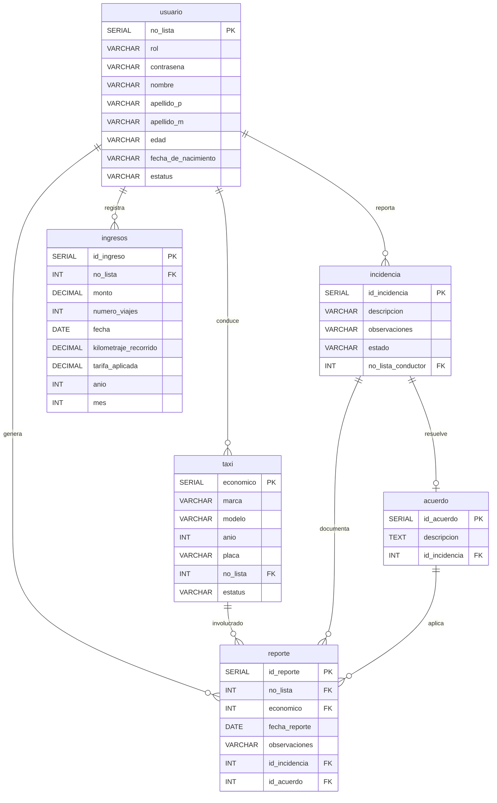

### Queries Principales por Entidad

#### Usuarios

```sql
-- Listar usuarios desencriptados
SELECT no_lista, rol, nombre, apellido_p, apellido_m, edad, fecha_de_nacimiento, estatus 
FROM usuario;

-- Obtener solo taxistas
SELECT no_lista, rol, nombre, apellido_p 
FROM usuario 
WHERE rol ILIKE 'taxista';

-- Insertar usuario encriptado
INSERT INTO usuario (rol, contrasena, nombre, apellido_p, apellido_m, edad, fecha_de_nacimiento, estatus)
VALUES ($1, $2, $3, $4, $5, $6, $7, $8)
RETURNING *;

-- Actualizar usuario (dinámico)
UPDATE usuario 
SET rol = $1, nombre = $2, apellido_p = $3, apellido_m = $4, edad = $5, fecha_de_nacimiento = $6, estatus = $7
WHERE no_lista = $8;
```

#### Taxis

```sql
-- Listar taxis con conductor (JOIN)
SELECT 
  t.economico, t.marca, t.modelo, t.anio, t.placa, t.no_lista, t.estatus,
  u.nombre, u.apellido_p 
FROM taxi t
LEFT JOIN usuario u ON t.no_lista = u.no_lista;

-- Insertar taxi con placa encriptada
INSERT INTO taxi (marca, modelo, anio, placa, no_lista, estatus) 
VALUES ($1, $2, $3, $4, $5, $6) 
RETURNING economico;
```

#### Incidencias

```sql
-- Listar incidencias con filtro y conductor
SELECT 
  i.id_incidencia,
  COALESCE(i.descripcion, '') AS descripcion,
  COALESCE(i.observaciones, '') AS observaciones,
  i.estado,
  i.no_lista_conductor,
  u.nombre,
  u.apellido_p
FROM incidencia i
LEFT JOIN usuario u ON i.no_lista_conductor = u.no_lista
WHERE i.estado = $1
ORDER BY i.id_incidencia DESC;
```

#### Reportes

```sql
-- Listar reportes completos (múltiples JOINs)
SELECT 
    r.*, 
    u.nombre, u.apellido_p, 
    t.placa, 
    i.descripcion AS incidencia_descripcion,
    a.descripcion AS acuerdo_descripcion
FROM reporte r
LEFT JOIN usuario u ON r.no_lista = u.no_lista
LEFT JOIN taxi t ON r.economico = t.economico
LEFT JOIN incidencia i ON r.id_incidencia = i.id_incidencia
LEFT JOIN acuerdo a ON r.id_acuerdo = a.id_acuerdo;
```

#### Ingresos

```sql
-- Verificar registro existente del mes
SELECT id_ingreso
FROM ingresos
WHERE no_lista = $1
AND anio = $2
AND mes = $3;

-- Acumular ingresos existentes
UPDATE ingresos
SET
  numero_viajes = numero_viajes + $1,
  kilometraje_recorrido = kilometraje_recorrido + $2,
  monto = monto + $3
WHERE id_ingreso = $4
RETURNING *;

-- Resumen mensual de taxista
SELECT
  COALESCE(SUM(numero_viajes), 0) AS total_viajes,
  COALESCE(SUM(monto), 0) AS ingresos_totales,
  COALESCE(SUM(kilometraje_recorrido), 0) AS km_totales
FROM ingresos
WHERE no_lista = $1
AND EXTRACT(MONTH FROM fecha) = $2
AND EXTRACT(YEAR FROM fecha) = $3;
```

#### Dashboard

```sql
-- Ranking ingresos últimos 30 días
SELECT u.nombre, 
      SUM(i.monto) as total_ingreso, 
      SUM(i.kilometraje_recorrido) as total_km,
      (SUM(i.monto) / NULLIF(SUM(i.kilometraje_recorrido), 0)) as eficiencia
FROM ingresos i
JOIN usuario u ON i.no_lista = u.no_lista
WHERE i.fecha >= CURRENT_DATE - INTERVAL '30 days'
GROUP BY u.nombre
ORDER BY total_ingreso DESC;

-- Resumen general 30 días
SELECT 
  (SELECT COUNT(*) FROM reporte WHERE fecha_reporte >= CURRENT_DATE - INTERVAL '30 days') as total_reportes,
  (SELECT COUNT(*) FROM usuario WHERE rol = 'Taxista') as total_taxistas,
  (SELECT COUNT(*) FROM taxi) as total_taxis;

-- Totales mes actual
SELECT 
  SUM(i.numero_viajes) AS total_viajes,
  SUM(i.kilometraje_recorrido) AS total_km,
  SUM(i.monto) AS total_ingreso
FROM ingresos i
WHERE DATE_TRUNC('month', i.fecha) = DATE_TRUNC('month', NOW());
```

---

## 🔒 Seguridad y Criptografía

### Encriptación AES-256-CBC

**Archivo:** `backend/crypto-utils.js`

**Algoritmo:** AES-256-CBC (Advanced Encryption Standard, Cipher Block Chaining)

**Características:**
- Clave de 32 caracteres (256 bits)
- IV aleatorio de 16 bytes por cada encriptación
- Formato de salida: `iv_hex:encrypted_hex`

```javascript
// Función de encriptación
export function encrypt(text) {
  const iv = crypto.randomBytes(IV_LENGTH);  // IV único por operación
  const cipher = crypto.createCipheriv('aes-256-cbc', Buffer.from(ENCRYPTION_KEY), iv);
  let encrypted = cipher.update(text);
  encrypted = Buffer.concat([encrypted, cipher.final()]);
  return iv.toString('hex') + ':' + encrypted.toString('hex');
}

// Función de desencriptación
export function decrypt(text) {
  if (!text || typeof text !== 'string' || !text.includes(':')) {
    return text;  // Retorna original si no está encriptado
  }
  const textParts = text.split(':');
  const iv = Buffer.from(textParts.shift(), 'hex');
  const encryptedText = Buffer.from(textParts.join(':'), 'hex');
  const decipher = crypto.createDecipheriv('aes-256-cbc', Buffer.from(ENCRYPTION_KEY), iv);
  let decrypted = decipher.update(encryptedText);
  decrypted = Buffer.concat([decrypted, decipher.final()]);
  return decrypted.toString();
}
```

### Hashing de Contraseñas

**Librería:** bcrypt ^6.0.0

**Salt Rounds:** 10

```javascript
// Hashear contraseña
const hashedPassword = await bcrypt.hash(contrasena, saltRounds);

// Verificar contraseña
const match = await bcrypt.compare(contrasena, hashedPasswordFromDB);
```

### Campos Encriptados

| Tabla | Campo | Tipo de Protección |
|-------|-------|-------------------|
| usuario | contrasena | bcrypt hash |
| usuario | nombre | AES-256-CBC |
| usuario | apellido_p | AES-256-CBC |
| usuario | apellido_m | AES-256-CBC |
| usuario | edad | AES-256-CBC |
| usuario | fecha_de_nacimiento | AES-256-CBC |
| taxi | placa | AES-256-CBC |

---

## ⚛️ Frontend Architecture

### Estructura de Componentes

```
src/
├── App.jsx                 # Router principal
├── main.jsx               # Entry point
└── components/
    ├── secure/
    │   ├── AuthContext.jsx  # Provider de autenticación
    │   └── ProtectedRoute.jsx # Guard de rutas
    ├── views/              # Vistas admin
    └── viewsTaxis/         # Vistas taxista
```

### Flujo de Estado

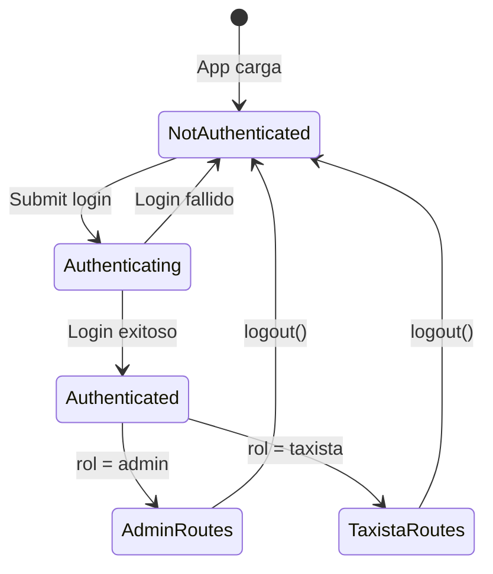

### Patrón de Componentes CRUD

Cada página de gestión sigue este patrón:

```javascript
function EntityPage() {
  // Estados
  const [entities, setEntities] = useState([]);
  const [form, setForm] = useState({...initialState});
  const [entityToEdit, setEntityToEdit] = useState(null);
  const [editForm, setEditForm] = useState(null);

  // Fetch inicial
  const fetchEntities = async () => {...};
  useEffect(() => { fetchEntities(); }, []);

  // Handlers
  const handleChange = (e) => {...};
  const handleSubmit = async (e) => {...};
  const handleDelete = async (id) => {...};
  const handleEditClick = (entity) => {...};
  const handleEditChange = (e) => {...};
  const handleUpdateSubmit = async (e) => {...};

  return (
    <>
      <Navbar />
      <FormularioCreación />
      <TablaListado />
      {entityToEdit && <ModalEdición />}
      <Footer />
    </>
  );
}
```

---

## 🚀 CI/CD y Despliegue

### Dockerfile Backend

```dockerfile
# Etapa 1: Dependencias
FROM node:18 AS builder
WORKDIR /app
COPY package*.json ./
RUN npm install
COPY . .

# Etapa 2: Producción
FROM node:18-slim
WORKDIR /app
COPY --from=builder /app /app
ENV NODE_ENV=production
ENV PORT=3000
RUN npm prune --production
EXPOSE 3000
CMD ["node", "server.js"]
```

### Configuración para Despliegue

| Plataforma | Configuración |
|------------|---------------|
| **AWS App Runner** | Dockerfile + variables de entorno |
| **Railway** | Auto-detect Node.js + PORT env |
| **Render** | Node.js runtime + build command |
| **Heroku** | Procfile: `web: node server.js` |

### Variables de Entorno Producción

```env
# Backend
DB_HOST=production-postgres-host
DB_USER=postgres
DB_PASSWORD=secure-password
DB_NAME=taxis_prod
PORT=3000
ENCRYPTION_KEY=production-32-char-key-here!!

# Frontend
VITE_API_URL=https://api.yourdomain.com
```

### Criterios de Calidad CI/CD (Recomendados)

| Criterio | Umbral | Herramienta |
|----------|--------|-------------|
| Linting | 0 errores | ESLint |
| Build Frontend | Exitoso | Vite |
| Build Backend | Exitoso | Node.js |
| Tests | 80% coverage | Jest (pendiente) |
| Vulnerabilidades | 0 críticas | npm audit |

---

## 📝 Notas de Mejora

### Prioridad Alta 🔴

| Área | Problema | Solución Propuesta |
|------|----------|-------------------|
| **Seguridad** | Clave de encriptación hardcodeada en `crypto-utils.js` | Mover a variable de entorno `ENCRYPTION_KEY` |
| **Autenticación** | sessionStorage sin tokens JWT | Implementar JWT con refresh tokens y httpOnly cookies |
| **API Security** | Sin rate limiting | Implementar `express-rate-limit` |
| **Backend** | Sin middleware de autenticación | Crear middleware `authMiddleware.js` que valide sesión en cada request |
| **Credenciales** | Password de MySQL en `migrate-data.js` | Remover o usar variables de entorno |

### Prioridad Media 🟠

| Área | Problema | Solución Propuesta |
|------|----------|-------------------|
| **Validación** | Sin validación de entrada formal | Implementar `express-validator` |
| **Error Handling** | Manejo de errores inconsistente | Crear middleware centralizado de errores |
| **Logging** | Solo `console.log/error` | Implementar Winston o Pino |
| **TypeScript** | Solo `dashboard.tsx` usa TS | Migrar todo el frontend a TypeScript |
| **API Versioning** | Sin versionado de API | Prefijo `/api/v1/` |

### Prioridad Baja 🟡

| Área | Problema | Solución Propuesta |
|------|----------|-------------------|
| **Testing** | Sin tests automatizados | Jest + Supertest (backend), Vitest + Testing Library (frontend) |
| **Paginación** | Sin paginación en listados | Implementar `LIMIT/OFFSET` con parámetros query |
| **Dependencias** | Deps de React en package.json del backend | Limpiar `package.json` del backend |
| **Documentación** | Sin OpenAPI/Swagger | Generar spec con `swagger-jsdoc` |
| **Caché** | Sin caching | Redis para sesiones y datos estáticos |

### Deudas Técnicas Específicas

```javascript
// server.js línea 8 - ENCRYPTION_KEY debería venir de env
const ENCRYPTION_KEY = process.env.ENCRYPTION_KEY || 'fallback-key';

// crypto-utils.js - Agregar validación de longitud de clave
if (ENCRYPTION_KEY.length !== 32) {
  throw new Error('ENCRYPTION_KEY must be exactly 32 characters');
}

// AuthContext.jsx - Considerar persistencia más segura
// sessionStorage es vulnerable a XSS
// Opción: httpOnly cookie con JWT

// Todas las páginas - Falta loading states
const [loading, setLoading] = useState(true);
// ... en fetch
setLoading(true);
try { ... } finally { setLoading(false); }
```

---

*Documentación técnica generada el 2026-02-07*
